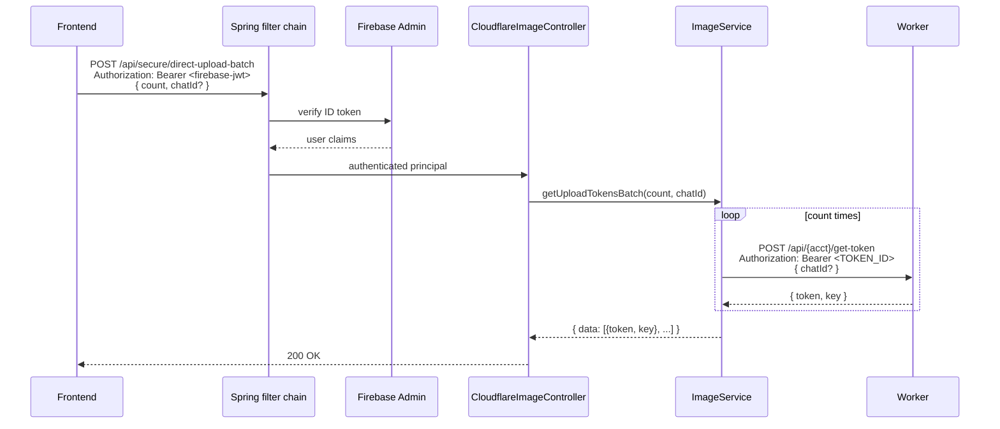

# Image Pipeline — Backend Codebase Audit (Phase 1)

**Status:** Read-only reconciliation, no code modified
**Date:** 2026-05-07
**Companion docs:** `IMAGE-PIPELINE-SPEC.md` (master spec),
`IMAGE-PIPELINE-FRONTEND-AUDIT.md` (frontend audit),
`IMAGE-PIPELINE-WORKER-NEEDS-FRONTEND.md` (frontend's contract needs)

This is the inventory of how the current Spring Boot backend handles
images. Every claim is cited with `file:line`. Used as ground truth
for the Phase 2 backend Worker-contract document.

---

## Table of Contents

- [1. Current image-service implementation](#1-current-image-service-implementation)
- [2. Current Worker integration](#2-current-worker-integration)
- [3. R2 bucket access](#3-r2-bucket-access)
- [4. Image key storage on entities](#4-image-key-storage-on-entities)
- [5. Chat image deletion path](#5-chat-image-deletion-path)
- [6. Permissions and middleware](#6-permissions-and-middleware)
- [7. Worker source location](#7-worker-source-location)
- [8. Other clients of the image pipeline](#8-other-clients-of-the-image-pipeline)
- [9. Defects and inconsistencies surfaced by the audit](#9-defects-and-inconsistencies-surfaced-by-the-audit)
- [10. Reconciliation against the master spec](#10-reconciliation-against-the-master-spec)

---

## 1. Current image-service implementation

### 1.A `DefaultImageService`

- **File:** `src/main/java/com/memento/tech/oglasino/images/service/impl/DefaultImageService.java`
- **Interface:** `images/service/ImageService.java` — five methods.

| Method | Purpose | Implementation |
|---|---|---|
| `getUploadToken(String chatId)` | Issue an upload token for client | POST to Worker `/api/{ACCOUNT_ID}/get-token` (line 38), Bearer `TOKEN_ID`, body `{ chatId? }` |
| `getViewToken(String chatId)` | Issue a chat view token | POST to Worker `/api/{ACCOUNT_ID}/get-view-token` (line 45), same auth, body `{ chatId }` |
| `deleteImageForUrl(String imageUrl)` | Delete by URL (used for profile picture) | Strips query string + path → `extractImageId` (line 100), then calls `r2Service.delete(key)` |
| `deleteImage(String imageKey)` | Delete by key | `r2Service.delete(imageKey)` (line 86) |
| `deleteImageBulk(Set<String> imageKeys)` | Bulk delete | Filters blanks, calls `r2Service.deleteBulk(...)` (line 94) |

**Wire shape today** for token requests:

```http
POST {WORKER_URL}/api/{cloudflare.account.id}/get-token
Authorization: Bearer {cloudflare.api.token}
Accept: application/json
Content-Type: application/json

{ "chatId": "abc-123" }   // chatId omitted for public uploads
```

`restTemplate.exchange(...)` is used directly (line 64). Response is
`Map<String, Object>` and is returned **as-is** to controllers — the
controller layer never types it. Today's frontend reads `{ token, key }`
out of this map.

**What `extractImageId` does** (line 97–102):

```java
var cleanUrl = imageUrl.split("\\?")[0];
return cleanUrl.substring(cleanUrl.lastIndexOf('/') + 1);
```

For bare UUID inputs (no slash), `lastIndexOf('/')` returns `-1`, so
`substring(0)` returns the input untouched. So this method works
correctly when fed either:

- a full URL like `https://cdn.oglasino.com/uuid-123?token=...` (returns `uuid-123`), or
- a raw key like `uuid-123` (returns `uuid-123`).

It does **not** work correctly for chat keys that contain a path
prefix — `chat-images/abc/uuid` → returns `uuid`, dropping the prefix.
This is fine for product/avatar deletion (which uses bare keys today)
but would be wrong if any chat-image deletion went through this path.

### 1.B Other image services and utilities

There is no separate "thumbnail," "resize," "variant," or "moderation"
service. The image stack is:

```text
controller (CloudflareImageController)
  → facade   (DefaultCloudflareImageFacade)
    → service (DefaultImageService)        ← Worker calls (token issuance, delete-via-Worker not used)
       → service (DefaultR2Service)         ← direct S3-compatible R2 calls
```

`DefaultCloudflareImageFacade` currently:

- `getUploadToken(chatId)` — pass-through to service.
- `getUploadTokensBatch(count, chatId)` — **calls `imageService.getUploadToken(chatId)` in a Java `for` loop, sequentially, one Worker round-trip per token.** No batching at the Worker layer. (`facade/impl/DefaultCloudflareImageFacade.java:23-27`)
- `getViewToken(chatId)` — pass-through.

### 1.C Places that construct or manipulate image keys

| Location | What it does | Reads from / Writes to |
|---|---|---|
| `DefaultImageService.extractImageId` (line 97–102) | Strips query, takes last path segment | URL or bare key → bare UUID |
| `DefaultR2Service.extractUid` (line 169–173) | Last path segment, strip extension | R2 key like `chat-images/abc/xyz.jpg` → `xyz` |
| `DefaultR2Service.normalizeFolder` (line 175–180) | Ensures trailing `/` | `chat-images` → `chat-images/` |
| `DefaultUserFacade.updateCurrentUserData` (line 97–101) | Gates deletion on `profileImageKey.contains(IMAGE_DOMAIN)` | Stored profile image — **see defect #2 in §9** |
| `DefaultProductService.deleteProduct` (line 349) | Forks a virtual thread; bulk-deletes `product.getImageKeys()` | Bare UUIDs from DB |
| `ChatImagesRemovalJob.removeOldChatImages` (line 56–69) | Lists `chat-images/` older than 30d, derives key set, calls bulk delete | **Currently buggy — see defect #1 in §9** |
| `DefaultCloudflareStatsService.getNumberOfChatImages` (line 19–21) | Lists `chat-images/` recursively (count only) | Admin stats |
| `DefaultCloudflareStatsService.getNumberOfProductImages` (line 14–16) | Lists root (`null` folder) — counts everything not in subfolders | Admin stats |

There is **no** central key-format helper, no domain-specific path
constants, no method like `productImageKey(uuid)` or `chatImageKey(chatId, uuid)`.
The `chat-images/` prefix is hardcoded as a string literal in three
separate places:

- `ChatImagesRemovalJob.java:60`
- `DefaultCloudflareStatsService.java:20`
- (frontend) `cloudflareService.ts:86` and `:25-26`

The Worker is the only component that adds a prefix on upload.

---

## 2. Current Worker integration

### 2.A Worker URL configuration

| Property | Source | Used by | Value example |
|---|---|---|---|
| `cloudflare.worker.url` | env `CLOUDFLARE_WORKER_URL` (set in `.env`) | `DefaultImageService:30` (Worker base for token POST) | `https://cdn-stage.oglasino.com/` |
| `cloudflare.worker.domain` | env `CLOUDFLARE_WORKER_DOMAIN` | `DefaultUserFacade:34` (substring check on stored profile image) | `cdn-stage.oglasino` |
| `cloudflare.account.id` | env `CLOUDFLARE_ACC_ID` | `DefaultImageService:25` (composes `/api/{acct-id}/...`) | a 32-char hex |
| `cloudflare.api.token` | env `CLOUDFLARE_API_TOKEN` | `DefaultImageService:28` (Bearer auth to Worker, named `TOKEN_ID` locally) | a Cloudflare API token |

Confirmed by `application-dev.yaml:64-73` and `application-prod.yaml:113-128`.

### 2.B Backend → Worker authentication today

- **Mechanism:** `Authorization: Bearer ${cloudflare.api.token}` set via Spring's `HttpHeaders.setBearerAuth(TOKEN_ID)` (line 51).
- **What this confirms vs. the frontend assumption:** the prompt
  describes today's auth as "Bearer `TOKEN_ID`" — confirmed.
  `TOKEN_ID` is a static shared secret stored in env (`CLOUDFLARE_API_TOKEN`)
  and rotated rarely.
- **NOT a JWT.** Today's Worker auth is a static Bearer token, not the
  HS256 JWT model that the new contract proposes for client→Worker.

### 2.C Backend → Worker calls — exhaustive list

There are exactly **two** places in the backend that call the Worker:

| Caller | HTTP | URL | Auth | Body | Response field of interest |
|---|---|---|---|---|---|
| `DefaultImageService.getUploadToken` | POST | `${WORKER_URL}/api/${ACCOUNT_ID}/get-token` | `Bearer ${cloudflare.api.token}` | `{ chatId? }` | `{ token, key, ... }` (Map passed through) |
| `DefaultImageService.getViewToken` | POST | `${WORKER_URL}/api/${ACCOUNT_ID}/get-view-token` | `Bearer ${cloudflare.api.token}` | `{ chatId }` | `{ token, ... }` (Map passed through) |

Backend does **not** call the Worker for delete, list, view, or any
admin operation. All deletions go through `R2Service` (direct S3 SDK).

The "batch" upload-token endpoint at `/api/secure/direct-upload-batch`
is implemented entirely in backend Java (a `for` loop over single-token
calls); it is **not** a Worker batch operation.

---

## 3. R2 bucket access

### 3.A `DefaultR2Service`

- **File:** `src/main/java/com/memento/tech/oglasino/images/service/impl/DefaultR2Service.java`
- **S3 client bean:** `S3Client` from AWS SDK for Java v2.42.28 (`pom.xml:104`).
- **Configuration:** `config/R2Config.java:17-31`.

```java
S3Client.builder()
    .credentialsProvider(StaticCredentialsProvider.create(
        AwsBasicCredentials.create(props.getAccessKey(), props.getSecretKey())))
    .region(Region.US_EAST_1)                          // required but ignored by R2
    .endpointOverride(URI.create(
        "https://" + props.getAccountId() + ".r2.cloudflarestorage.com"))
    .serviceConfiguration(S3Configuration.builder().pathStyleAccessEnabled(true).build())
    .httpClient(UrlConnectionHttpClient.builder().build())
    .build();
```

- **Endpoint:** `https://{cloudflare.r2.account-id}.r2.cloudflarestorage.com`
  (path-style addressing — required for R2 S3 compatibility).
- **Credentials:** `cloudflare.r2.access-key` / `cloudflare.r2.secret-key`
  (env: `CLOUDFLARE_ACCESS_KEY` / `CLOUDFLARE_SECRET_KEY`).

### 3.B Are R2 credentials separate from Worker credentials?

**Yes — they are separate secrets.** Two distinct credential
families:

| Credential | Used for | Variable | Where in code |
|---|---|---|---|
| R2 S3 access key + secret | Direct S3 calls from `R2Service` | `CLOUDFLARE_ACCESS_KEY`, `CLOUDFLARE_SECRET_KEY` | `R2Config.java:23-25` |
| Cloudflare API token (`TOKEN_ID`) | Bearer auth to the Worker | `CLOUDFLARE_API_TOKEN` | `DefaultImageService.java:28, 51` |

The R2 access keys are scoped to bucket-level S3 access; the API token
is broader (and is the same value used by `DefaultCloudflareKvService`
for KV writes as well — `service/impl/DefaultCloudflareKvService.java`
shares this token).

### 3.C R2Service capabilities

| Method | Purpose | Notes |
|---|---|---|
| `delete(String key)` | Single-key delete | Direct `DeleteObjectRequest` |
| `deleteBulk(List<String> keys)` | Batch delete | Chunks at 1000 (S3 hard limit), `quiet(true)`, logs error per failed key |
| `getNumberOfImages(String folder)` | Count one folder, NOT recursive | Uses `delimiter("/")` — won't see subfolder objects |
| `getNumberOfImages(String folder, boolean includeSubfolders)` | Count, optionally recursive | Without delimiter when `includeSubfolders=true` |
| `getImagesOlderThan(String folder, Instant cutoff)` | List + filter by `lastModified` | Returns `ImageMetadata(uid, key, createdAt, size, contentType)` — **note:** `contentType` is always `null`, set by the head not the list |

So **yes, `R2Service` has list capability** (`getNumberOfImages`,
`getImagesOlderThan`). Used today by `ChatImagesRemovalJob` and
admin stats.

---

## 4. Image key storage on entities

### 4.A Entities with image fields

| Entity | Field | Java type | DB shape | Notes |
|---|---|---|---|---|
| `Product` | `imageKeys` | `Set<String>` | `@ElementCollection` → table `product_images(product_id, image_keys)` (`Product.java:80-82`) | One row per image; no ordering preserved |
| `User` | `profileImageKey` | `String` (single) | Column on `users` table (`User.java:60`) | Nullable, no length constraint shown |
| `Review` | `imageKeys` | `Set<String>` | `@ElementCollection` → table `review_images(review_id, image_key)` (`Review.java:51-53`) | Similar to Product |

No image fields on `Message` (chat messages live in Firestore — see §5),
no image field on `Report` (planned for v2 per spec).

### 4.B Format of stored keys today — confirmed bare UUID, no prefix

The frontend audit's finding is confirmed by:

- `cloudflareService.ts:25-26` — chat URLs are reconstructed by the
  frontend, prefixing `chat-images/{activeChatId}/{key}`.
- `DefaultProductService.deleteProduct` (line 349) — passes
  `product.getImageKeys()` straight to `r2Service.deleteBulk`. If keys
  were stored with a prefix the deletion would target a different R2
  path; the fact that it works today is evidence keys are bare.
- The seed data in `data/translations/`, `data/basesite/` etc. has no
  image prefix examples to cross-check, but:
- The `DirectUploadResponseDTO` returns whatever `Map<String, Object>`
  came from the Worker as `{ data: [...] }`, so the `key` value is
  literally what the Worker returned — and today's Worker returns a
  bare UUID, per the spec's "current state" section.

**Conclusion:** today's stored keys are bare UUIDs (e.g., `abc-123`),
with the chat prefix `chat-images/{chatId}/` added at read-time by
the frontend and inferred at write-time by the Worker.

### 4.C Where the prefix is added on read or write

- **On write (chat upload):** added by the Worker (frontend hits
  `${WORKER_URL}/chat-images/${key}` — see frontend audit
  `cloudflareService.ts:86`).
- **On read (chat URL):** added by the frontend
  (`getChatImageForKey` in `cloudflareService.ts:25-26`).
- **For public images:** no prefix is ever added — the bucket has
  flat `{uuid}.{ext}` at the root.

The backend currently has **no logic** to add or strip path prefixes.
This is a clean slate for whatever convention the new contract
chooses.

---

## 5. Chat image deletion path

### 5.A When a chat or message is deleted

**Chats live in Firebase / Firestore**, not in the backend's Postgres
database. The only backend Java that touches chat data lives in
`admin/service/impl/DefaultFirebaseChatService.java` and the
`admin/controller/FirebaseChatController.java` — both are **read-only**
(list chats, list messages — no delete). The backend has no code path
that fires when a chat is deleted or a message containing an image is
deleted.

So the answer to "when a chat is deleted, what cleans up R2
chat-images?" is: **nothing event-driven.** The only cleanup is the
30-day scheduled job described below.

### 5.B Scheduled cleanup — `ChatImagesRemovalJob`

- **File:** `src/main/java/com/memento/tech/oglasino/images/job/ChatImagesRemovalJob.java`
- **Schedule:** `@Scheduled(cron = "${app.images.chat.removal}")` —
  resolved to `0 0 3 * * SUN` (Sundays 03:00 — `application-prod.yaml:191`).
- **What it does:** lists every R2 object under `chat-images/` whose
  `lastModified` is older than 30 days, then attempts bulk delete.
- **Defect:** the job builds the deletion set from
  `ImageMetadata::uid`, which is the **filename without extension and
  without folder prefix**. The actual R2 key is
  `chat-images/{chatId}/{uuid}.{ext}` — so `r2Service.deleteBulk(...)`
  is called with bare `uuid` values that don't match any real R2 key.
  Logged errors get swallowed (line 75 catches `Exception`). See defect
  #1 in §9.

### 5.C Backend handles deletion via R2Service directly (not via Worker)

**Confirmed.** Every deletion path in the codebase calls `R2Service`
methods directly — none of them go through the Worker:

| Trigger | Path |
|---|---|
| User deletes their profile picture (via `updateCurrentUserData`) | `DefaultUserFacade:100` → `imageService.deleteImageForUrl(url)` → `r2Service.delete(key)` |
| Product deletion | `DefaultProductService:349` → `imageService.deleteImageBulk(keys)` → `r2Service.deleteBulk(keys)` |
| Scheduled chat-image cleanup | `ChatImagesRemovalJob:60-68` → `r2Service.getImagesOlderThan(...)` + `imageService.deleteImageBulk(...)` (broken — see above) |

The Worker's only participation in any of these flows is **issuing
upload/view tokens.** It is not on any deletion path.

---

## 6. Permissions and middleware

### 6.A SecurityConfig path-based auth

`security/config/SecurityConfig.java:72-81`:

```java
.authorizeHttpRequests(
    auth ->
        auth.requestMatchers(HttpMethod.OPTIONS, "/**")
            .permitAll()
            .requestMatchers("/api/public/**", "/api/auth/**", "/internal/**")
            .permitAll()
            .requestMatchers("/api/secure/**")
            .authenticated()
            .anyRequest()
            .permitAll())
```

There is **no** explicit `/api/secure/images/...` matcher — image
endpoints sit under the generic `/api/secure/**` → `authenticated()`
rule. Authentication is supplied by `FirebaseAuthFilter`
(verifies Firebase ID token in `Authorization: Bearer …` header) and
optionally by `InternalTokenFilter` for `/internal/**` paths (not
relevant here). Rate limiting is `RateLimitFilter` per-endpoint, not
applied to image endpoints today.

### 6.B Image endpoints exposed by the backend

All three live in `images/controller/CloudflareImageController.java`,
`@RequestMapping("/api/secure")`:

| Endpoint | Method | Path | Request body | Response body | Auth |
|---|---|---|---|---|---|
| Single upload token | `POST` | `/api/secure/direct-upload` | `CloudflareUploadRequest` (optional) — `{ count?: int = 1, chatId?: string }` | `Map<String, Object>` (passes through whatever Worker returned, today `{ token, key, ... }`) — HTTP 201 | `authenticated()` |
| Batch upload tokens | `POST` | `/api/secure/direct-upload-batch` | `CloudflareUploadRequest` — `{ count: int, chatId?: string }` | `DirectUploadResponseDTO` — `{ data: [Map<String, Object>, ...] }` — HTTP 200 | `authenticated()` |
| View token (chat) | `POST` | `/api/secure/view-token` | `CloudflareViewRequest` — `{ chatId: string }` (`@NotBlank`) | `Map<String, Object>` (passes through Worker — today `{ token }`) — HTTP 201 | `authenticated()` |

The frontend audit's table (rows "Token request (single/batch)" and
"View token request") matches except for the `data` wrapper on the
batch response — see defect #3 in §9.

`CloudflareUploadRequest` (DTO, line 4): `count` defaults to `1`, no
upper bound. `CloudflareViewRequest`: only `chatId` (`@NotBlank`).
No validation enforces `count ≤ 5` or content-type — the controller
trusts whatever the client sends.

### 6.C Identity flow on a token request



Backend does **not** verify chat membership before issuing a chat
upload/view token. It only verifies the user is authenticated. The
Worker does the chat-binding check today (in its `get-view-token`
endpoint per the spec). This is a known coupling we should resolve in
the contract — see §9 defect #4.

---

## 7. Worker source location

**Not in this repo.** Searched for `wrangler*`, `*.toml`, any `worker/`
directory, any `.js` or `.ts` files outside `target/` and
`node_modules/` — none found. The backend repo contains:

- The Spring Boot service that calls the Worker (this audit's subject).
- Cloudflare-related Java code: `R2Config`, `R2Service`, `ImageService`,
  `CloudflareKvService`, `CloudflareStatsService`.
- No `package.json`, no `wrangler.toml`, no Worker source.

The Worker repo location is not documented inside this codebase.
The spec mentions it lives elsewhere; this audit can't confirm where.
**Action for Phase 2:** the contract document should call out that
Worker source repo location must be fixed and recorded in the unified
contract.

---

## 8. Other clients of the image pipeline

### 8.A Background jobs touching images

| Job | File | Schedule | Effect |
|---|---|---|---|
| Chat-image cleanup | `images/job/ChatImagesRemovalJob.java` | `0 0 3 * * SUN` (Sundays 03:00) | Lists `chat-images/` ≥ 30 days old, calls bulk delete (broken — defect #1) |
| Product removal | `jobs/ProductRemovalJob.java` | `0 0 2 ? * SUN` (Sundays 02:00) | Removes old products; `DefaultProductService.deleteProduct` deletes their images via virtual thread |
| Other `@Scheduled` | (Currency, view-counter flush) | various | Do not touch images |

### 8.B Admin tooling

`admin/service/impl/DefaultCloudflareStatsService.java` — only reads
counts:

- `getNumberOfProductImages()` → `r2Service.getNumberOfImages(null)`
  (root, non-recursive).
- `getNumberOfChatImages()` → `r2Service.getNumberOfImages("chat-images", true)`
  (recursive).

Surfaced via admin stats facade (`admin/facade/impl/DefaultStatsFacade.java`)
on the admin dashboard. **No admin endpoints write or delete images
through the Worker.**

### 8.C Resizing / variant generation / moderation

**None.** No code matches `resize`, `thumbnail`, `variant`, `moderate`,
`watermark`, `imagemagick`, `sharp` in `src/main/java/`. The image
pipeline today is:

- Receive bytes (Worker → R2)
- Store key in DB (entity field)
- Serve original via `https://cdn.oglasino.com/{key}` or
  `https://cdn.oglasino.com/chat-images/{chatId}/{key}?token=...`
- Delete via `R2Service`

No backend-side image processing exists. The spec's Track 2 (variants)
and Track 3 (watermark) are greenfield — there's no existing pipeline
to disturb on the backend side.

---

## 9. Defects and inconsistencies surfaced by the audit

> **Note:** the prompt says to flag spec contradictions and existing
> issues for Phase 2 reconciliation. These are flagged here, **not
> fixed.** Phase 1 is read-only.

### Defect #1 — `ChatImagesRemovalJob` is currently broken

`ChatImagesRemovalJob.java:60-68`:

```java
var oldChatImages = r2Service.getImagesOlderThan("chat-images", thirtyDaysAgo);
// oldChatImages[i].uid()  → "uuid"  (extension stripped, prefix dropped)
// oldChatImages[i].key()  → "chat-images/{chatId}/uuid.jpg"   ← actual R2 key
var keysForRemoval =
    oldChatImages.stream()
        .map(DefaultR2Service.ImageMetadata::uid)   // ← WRONG: uid, not key
        .collect(Collectors.toSet());

imageService.deleteImageBulk(keysForRemoval);
```

The bulk-delete is called with a set of bare UUIDs (no folder, no
extension), which won't match any real R2 object. R2 returns a
per-key error in `deleteObjects`; `R2Service.deleteBulk` logs each
failure (`r2Service.deleteBulk:65-72`) but the surrounding job
swallows the exception. **Net result:** chat images are never deleted
by this job in any environment that has run it.

**Fix:** change `::uid` to `::key`. Out of scope for Phase 1.

### Defect #2 — `DefaultUserFacade` profile-image deletion gate is brittle

`DefaultUserFacade.java:97-101`:

```java
if (Objects.nonNull(user.getProfileImageKey())
    && user.getProfileImageKey().equals(updateData.getProfileImageKey())) {
  if (user.getProfileImageKey().contains(IMAGE_DOMAIN)) {
    imageService.deleteImageForUrl(user.getProfileImageKey());
  }
}
```

Two issues with this:

1. The outer `equals` check means the old image is **only** deleted
   when the new key matches the old — i.e., when the user "updates"
   to the same value. That's almost certainly inverted: the intent
   is "if the user is replacing their image, delete the old one." It
   should be `!equals`.
2. The inner `contains(IMAGE_DOMAIN)` gate makes the delete a no-op
   unless the stored value is a full URL containing the domain string.
   Since today's stored values are bare UUIDs (per §4.B), this
   condition is always false. Old profile images are not deleted.

**Net result:** orphaned profile images accumulate in R2. Out of
scope for Phase 1.

### Defect #3 — Batch token response shape mismatches frontend audit

- `DirectUploadResponseDTO.java:6-8` returns `{ data: [...] }`.
- `IMAGE-PIPELINE-FRONTEND-AUDIT.md:407` documents the response as
  `Array<{ token: string, key: string }>`.

Either the frontend's `cloudflareService.ts:46-67` extracts
`response.data` (most likely) or there's an `axios` interceptor
unwrapping `data` automatically. Either way, the audit doc says one
thing and the wire shape is another. **Worth nailing down in the new
contract** so the new endpoint name/shape is unambiguous.

### Defect #4 — Backend doesn't verify chat membership before issuing tokens

The view-token endpoint accepts any authenticated user with a
non-blank `chatId` (`CloudflareViewRequest`) and forwards to the
Worker. The Worker historically does the chat-membership check, but:

- The backend has the user's Firebase principal in scope.
- Chat membership lives in Firestore, queried by
  `DefaultFirebaseChatService` (read-only).
- Today's Worker has no Firestore access.

Logically the membership check belongs in the backend — the Worker
in the new contract should trust a backend-issued JWT that already
encodes the (user, chatId) binding. Frontend's contract doc agrees
(§B.3 of `IMAGE-PIPELINE-WORKER-NEEDS-FRONTEND.md`). The Phase 2
contract should explicitly relocate the membership check to the
backend.

### Defect #5 — Hardcoded `chat-images/` literal in 3 places

- `ChatImagesRemovalJob.java:60`
- `DefaultCloudflareStatsService.java:20`
- (frontend) `cloudflareService.ts:86, :25-26`

Refactor target after the new contract lands: a single constant or
domain enum (`ChatImagesPath.PREFIX = "private/chats/"`). Out of scope
for Phase 1.

### Defect #6 — `getUploadTokensBatch` is not actually a batch

`DefaultCloudflareImageFacade.java:23-27`:

```java
for (int i = 0; i < count; i++) {
  urls.add(imageService.getUploadToken(chatId));
}
```

For a 5-image upload, the backend makes 5 sequential HTTPS calls to
the Worker. There's no parallelism, no `CompletableFuture`, no
retry. With 100ms RTT to the Worker, the user waits 500ms minimum
before the upload PUT can even start. A real batch endpoint at the
Worker would let the backend issue all N tokens in a single call.
**Worth raising in the new contract** as Phase 2 §B (backend-only
operations).

### Defect #7 — Untyped Worker responses

Both `getUploadToken` and `getViewToken` return `Map<String, Object>`
all the way up to the controller. There is no DTO, no schema check,
and no error mapping. If the Worker ever returns a malformed
response, the frontend gets the malformed map verbatim. The new
contract should drive a typed response (`UploadTokenResponse`
record etc.) on the backend side.

---

## 10. Reconciliation against the master spec

Cross-checking the spec's "current state" claims against the actual
codebase:

| Spec claim (`IMAGE-PIPELINE-SPEC.md`) | Reality | Match? |
|---|---|---|
| `DefaultImageService` calls Worker to get tokens | ✓ confirmed (`DefaultImageService:38, :45`) | Yes |
| `R2Service` handles direct R2 deletion (S3-compatible) | ✓ confirmed (`R2Config.java`) | Yes |
| Image keys stored on entities (not full URLs) | ✓ for Product / Review (Set<String>); ✓ for User in normal usage. The `DefaultUserFacade.contains(IMAGE_DOMAIN)` gate suggests at one point full URLs were considered. | Yes (with §9 #2 caveat) |
| Frontend constructs URLs from keys via direct R2 access | ✓ confirmed in frontend audit | Yes |
| Worker `POST /api/{accountId}/get-token` exists | ✓ called by `DefaultImageService.java:38` | Yes |
| Worker `POST /api/{accountId}/get-view-token` exists | ✓ called by `DefaultImageService.java:45` | Yes |
| Worker `PUT /` accepts upload with `x-upload-token` header | (frontend side) — confirmed by frontend audit | Yes |
| Worker `GET /` serves images, validates `?token=` for chat-images path | (frontend side) — confirmed by frontend audit | Yes |
| Token TTL: 10 minutes hardcoded | The backend doesn't see the TTL; it's a Worker-side concern. Spec asserts 10 min — accepted on faith pending Worker source review. | Indirect |
| Backend handles deletion via R2Service (not Worker) | ✓ confirmed (every deletion path) | Yes |
| Image keys are bare UUID, no prefix | ✓ confirmed (every storage and read path) | Yes |
| Chat images reorganization is a fresh-data migration (pre-prod) | ✓ — the only migration constraint is `chat-images/` literal in 3 source files (+ existing seed data has none) | Yes |

**No spec contradictions surfaced.** The seven items in §9 are
defects in the existing code, not disagreements with the spec.

---

**End of Phase 1 audit.** Goes into the Phase 2 needs document
(`IMAGE-PIPELINE-WORKER-NEEDS-BACKEND.md`).
