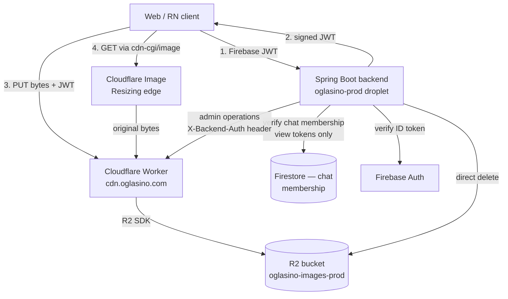

# Oglasino — Image Pipeline Worker Contract (Unified)

**Status:** Approved — implementation can begin
**Owner:** Igor
**Last updated:** 2026-05-07
**Source documents:**
- `IMAGE-PIPELINE-SPEC.md` — master spec (architecture, tracks, goals)
- `IMAGE-PIPELINE-WORKER-NEEDS-FRONTEND.md` — frontend's contract requirements
- `IMAGE-PIPELINE-WORKER-NEEDS-BACKEND.md` — backend's contract requirements
- `IMAGE-PIPELINE-FRONTEND-AUDIT.md` — frontend codebase reality
- `IMAGE-PIPELINE-BACKEND-AUDIT.md` — backend codebase reality

This document is the **single source of truth** for the new Cloudflare Worker, the backend endpoints that orchestrate it, and the contracts between web frontend, backend, and Worker. Implementation work that contradicts this document is a defect.

---

## Table of Contents

- [1. Architecture overview](#1-architecture-overview)
- [2. Authentication model](#2-authentication-model)
- [3. Backend HTTP endpoints](#3-backend-http-endpoints)
- [4. Worker HTTP endpoints](#4-worker-http-endpoints)
- [5. JWT structure and signing](#5-jwt-structure-and-signing)
- [6. R2 bucket organization](#6-r2-bucket-organization)
- [7. Database changes](#7-database-changes)
- [8. Error response format](#8-error-response-format)
- [9. CORS policy](#9-cors-policy)
- [10. Logging and observability](#10-logging-and-observability)
- [11. Rate limiting](#11-rate-limiting)
- [12. Configuration values](#12-configuration-values)
- [13. Image processing rules](#13-image-processing-rules)
- [14. Cloudflare Image Resizing variants](#14-cloudflare-image-resizing-variants)
- [15. Existing defects to fix in this PR](#15-existing-defects-to-fix-in-this-pr)
- [16. Worker repository and deployment](#16-worker-repository-and-deployment)
- [17. Implementation order](#17-implementation-order)
- [18. Out of scope for this PR](#18-out-of-scope-for-this-pr)
- [19. Acceptance criteria](#19-acceptance-criteria)

---

## 1. Architecture overview

### 1.1 Components



### 1.2 Component responsibilities

| Component | Responsibility | NOT responsible for |
|---|---|---|
| **Backend** | Verify Firebase auth, verify chat membership, sign JWTs, return tokens to clients, manage entity image fields, handle deletion via R2 SDK | Image bytes, image processing, transformation, watermarking |
| **Worker** | Verify JWTs on PUT/GET, validate uploads (size, type, path), stream bytes to/from R2, emit logs | Token issuance, user identity, chat membership, image transformation |
| **Cloudflare Image Resizing** | Generate variants (resize, format conversion, watermark draw) on `/cdn-cgi/image/...` paths | Storage, auth, original byte serving |
| **R2** | Store image bytes | Anything else |
| **Frontend (web)** | UI, browser-side processing (resize, compress, format), URL construction with variants, view token caching | JWT signing, R2 access |

### 1.3 Two flows the contract must support

**Upload flow (PUT):**

```
1. Client requests upload tokens from backend (Firebase JWT)
2. Backend verifies user, signs N JWTs (one per file), returns array
3. Client (browser-side): processes each file (resize, compress, HEIC→JPEG)
4. Client PUTs each file directly to Worker with its JWT
5. Worker verifies JWT, validates size/type/path, writes to R2, returns key
6. Client sends keys to backend for entity association (create product, etc.)
```

**Display flow (GET):**

For public images (products, profiles):
```
1. Client constructs URL: https://cdn.oglasino.com/cdn-cgi/image/{variant}/{key}
2. Cloudflare Image Resizing fetches original from Worker
3. Worker serves R2 bytes (no auth check — key is in `public/` allowlist)
4. Image Resizing transforms (resize, watermark, format) and serves
5. Cloudflare edge caches transformed result
```

For private images (chat attachments):
```
1. Client requests view token from backend (Firebase JWT + chatId)
2. Backend verifies chat membership via Firestore, signs view JWT, returns
3. Client constructs URL: https://cdn.oglasino.com/{key}?token={JWT}
4. Worker verifies JWT, validates chatId binding, serves R2 bytes
5. NO Image Resizing for private images (v1) — original size only
```

---

## 2. Authentication model

### 2.1 Two distinct secrets, two distinct purposes

| Concern | Auth mechanism | Secret | Verified by |
|---|---|---|---|
| **Backend → Worker** (admin operations) | Static shared secret in `X-Backend-Auth` header | `BACKEND_SHARED_SECRET` | Worker constant-time compare |
| **Client → Worker** (PUT/GET) | JWT HS256 | `JWT_SIGNING_SECRET` | Worker JWT verify |

The two secrets MUST be different values. Compromise of either does not compromise the other.

### 2.2 `X-Backend-Auth` for backend → Worker

```http
POST /api/admin/images/bulk-delete HTTP/1.1
Host: cdn.oglasino.com
X-Backend-Auth: <BACKEND_SHARED_SECRET>
Content-Type: application/json
```

- Backend MUST send this header on every server-to-server admin call
- Worker MUST require this header on `/api/admin/*` paths
- Worker MUST use constant-time comparison
- Worker MUST NOT fall back to other auth methods on admin paths
- Authorization header is NOT used for backend → Worker (reserved for future client paths if needed)

### 2.3 JWT HS256 for client → Worker

Backend signs, Worker verifies. Algorithm: HS256. Same secret on both sides.

Token rotation strategy: **dual-key window** (backend's OQ-1 recommendation).

- Worker has two env vars: `JWT_SIGNING_SECRET` and optional `JWT_SIGNING_SECRET_PREVIOUS`
- On verify: try current secret first, fall back to previous if present and current fails
- Backend signs with current secret only
- Rotation: backend deploys new current → Worker deploys current as previous + new as current → wait one full TTL → drop previous
- `kid` (key ID) header NOT used in v1; added when first rotation happens

### 2.4 Today's `Bearer TOKEN_ID` becomes obsolete

The current `Authorization: Bearer ${cloudflare.api.token}` to the Worker is removed entirely. The Cloudflare API token continues to be used for its legitimate Cloudflare API consumers (KV writes via `DefaultCloudflareKvService`) but never reaches the Worker again.

### 2.5 Firebase JWT only used between client and backend

The Worker has zero knowledge of Firebase. Firebase ID tokens are verified at the backend (existing `FirebaseAuthFilter`) and never forwarded to the Worker.

---

## 3. Backend HTTP endpoints

All under `/api/secure/images/`. Both require Firebase JWT in `Authorization: Bearer …` header (existing `/api/secure/**` security model).

### 3.1 `POST /api/secure/images/upload-tokens`

Issues N upload JWTs. Replaces `/api/secure/direct-upload` and `/api/secure/direct-upload-batch`.

**Request:**

```json
{
  "scope": "product",
  "count": 3,
  "contentTypes": ["image/jpeg", "image/jpeg", "image/png"],
  "chatId": "abc-123"
}
```

| Field | Type | Required | Validation |
|---|---|---|---|
| `scope` | enum: `"product" \| "profile" \| "chat" \| "report"` | yes | open enum (forward-compatible for `report` v2) |
| `count` | integer | yes | 1 ≤ count ≤ 5 |
| `contentTypes` | array of strings | yes | length === count, each in `["image/jpeg", "image/png", "image/webp", "image/heic", "image/heif"]` |
| `chatId` | string | conditional | required when `scope === "chat"`, forbidden otherwise |

**Response 200:**

```json
{
  "tokens": [
    {
      "token": "<JWT-HS256>",
      "key": "public/products/9f3e1c20-abcd-1234-efgh-567890abcdef.jpg",
      "uploadUrl": "https://cdn.oglasino.com/public/products/9f3e1c20-abcd-1234-efgh-567890abcdef.jpg",
      "expiresAt": "2026-05-07T14:30:00Z"
    }
  ]
}
```

| Field | Type | Description |
|---|---|---|
| `tokens` | array | One entry per requested image |
| `tokens[].token` | string (JWT) | Bearer JWT for client to PUT with |
| `tokens[].key` | string | Full key with prefix; client stores this in DB |
| `tokens[].uploadUrl` | string (URL) | Convenience: `${CDN_BASE}/${key}` — client PUTs here |
| `tokens[].expiresAt` | string (ISO-8601 UTC) | When the JWT expires |

**Backend validation rules:**

1. Authenticated user (Firebase JWT verified)
2. Schema validation per table above
3. For `scope === "chat"`: verify user is a member of `chatId` via Firestore (fixes audit defect #4)
4. Apply rate limit category `IMAGE_TOKEN_ISSUANCE` (60 tokens/minute per user)
5. Generate `count` UUIDs (one per file)
6. Sign one JWT per file with appropriate claims (see §5.1)
7. Return array of token objects

**Errors:**

| HTTP | Code | When |
|---|---|---|
| 400 | `INVALID_SCOPE` | Scope value not in enum |
| 400 | `INVALID_COUNT` | count < 1 or > 5 |
| 400 | `CONTENT_TYPES_MISMATCH` | array length != count |
| 400 | `CONTENT_TYPE_NOT_ALLOWED` | content type not in allowlist |
| 400 | `CHAT_ID_REQUIRED` | scope=chat without chatId |
| 400 | `CHAT_ID_NOT_ALLOWED` | non-chat scope with chatId |
| 401 | `UNAUTHENTICATED` | Firebase JWT missing/invalid |
| 403 | `NOT_CHAT_MEMBER` | user not in Firestore chat participants |
| 429 | `RATE_LIMITED` | bucket exhausted |

### 3.2 `POST /api/secure/images/view-tokens`

Issues a view JWT for a private image set. Replaces `/api/secure/view-token`.

**Request:**

```json
{
  "scope": "chat",
  "chatId": "abc-123"
}
```

| Field | Type | Required | Validation |
|---|---|---|---|
| `scope` | enum: `"chat"` (only chat in v1; `"report"` added in v2) | yes | enum |
| `chatId` | string | yes when scope=chat | non-blank |

**Response 200:**

```json
{
  "token": "<JWT-HS256>",
  "expiresAt": "2026-05-07T18:30:00Z",
  "scope": "chat",
  "chatId": "abc-123"
}
```

**Backend validation rules:**

1. Authenticated user
2. Verify user is a member of `chatId` via Firestore (fixes audit defect #4)
3. Apply rate limit (same `IMAGE_TOKEN_ISSUANCE` category)
4. Sign view JWT with appropriate claims (see §5.2)

**Errors:** same set as §3.1 where applicable, plus `403 NOT_CHAT_MEMBER`.

### 3.3 Endpoints retired in this PR

These existing endpoints are removed (per §17 the cutover is single PR — no transition period since pre-production):

- `POST /api/secure/direct-upload` — replaced by `/upload-tokens` with `count: 1`
- `POST /api/secure/direct-upload-batch` — replaced by `/upload-tokens`
- `POST /api/secure/view-token` — replaced by `/view-tokens`

Frontend audit shows these are the only callers; safe to remove.

### 3.4 Internal admin operations (NOT exposed via HTTP)

Backend → Worker admin operations are NOT routed through the Worker for v1. Decision per backend §B.2:

- **Single delete**: backend's `R2Service.delete(key)` calls R2 directly (existing code, keep)
- **Bulk delete**: backend's `R2Service.deleteBulk(keys)` calls R2 directly (existing code, keep)
- **List by prefix**: backend's `R2Service.getNumberOfImages` and `getImagesOlderThan` call R2 directly (existing code, keep)

The Worker has NO admin endpoints in v1. The `X-Backend-Auth` header model is specified in §2.2 in case a future need arises, but no Worker endpoints currently use it.

---

## 4. Worker HTTP endpoints

The Worker is purely a byte gateway with token validation. Three endpoint types.

### 4.1 `PUT /{key}` — Upload

```http
PUT /public/products/9f3e1c20-abcd-1234-efgh-567890abcdef.jpg HTTP/1.1
Host: cdn.oglasino.com
x-upload-token: <JWT-HS256>
Content-Type: image/jpeg
Content-Length: 482301

<raw bytes>
```

**Headers:**

- `x-upload-token`: JWT, required
- `Content-Type`: required, must match JWT `contentType` claim
- `Content-Length`: required, must be ≤ JWT `maxBytes` claim

**Body:** raw bytes (NOT multipart/form-data). Worker reads `request.body` as a stream.

**Validation order (fail fast):**

1. Path traversal check: reject `..`, absolute paths, backslashes, encoded path tricks
2. Header presence: `x-upload-token`, `Content-Type`, `Content-Length`
3. JWT verification (HS256, current then previous secret)
4. JWT not expired
5. JWT scope === `"upload"`
6. JWT key matches request path exactly
7. JWT contentType matches request `Content-Type`
8. Content-Length ≤ JWT maxBytes
9. Content-Type in `ALLOWED_CONTENT_TYPES` env list
10. Idempotency check: R2 head request on the key
    - If object exists with same content-type and bytes ≈ Content-Length: return success (idempotent retry)
    - Otherwise: proceed
11. Stream bytes to R2 via R2 binding
12. Return success response

**Success Response 200:**

```json
{
  "key": "public/products/9f3e1c20-abcd-1234-efgh-567890abcdef.jpg",
  "bytes": 482301,
  "contentType": "image/jpeg"
}
```

Headers:
- `x-request-id: <UUID>`
- `Content-Type: application/json`
- CORS headers per §9

**Error responses:** see §8 for full JSON shape. Status codes per the table in §8.3.

### 4.2 `GET /{key}` — Display (public + private)

```http
GET /public/products/9f3e1c20.jpg?token={view-jwt} HTTP/1.1
Host: cdn.oglasino.com
```

**For `public/*` keys (no token required):**

1. Path traversal check
2. R2 get request
3. If 404: return 404 with body `{ error: { code: "OBJECT_NOT_FOUND" } }`
4. Stream bytes to client with:
   - `Content-Type` from R2 object metadata
   - `Cache-Control: public, max-age=31536000, immutable`
   - `Vary: Accept` (so format negotiation works for downstream Image Resizing)
   - `x-request-id`
   - CORS headers per §9 (only if Origin header present)

**For `private/*` keys (token required):**

1. Path traversal check
2. Token presence check (query param `?token=`)
3. JWT verification (HS256)
4. JWT not expired
5. JWT scope === `"view"`
6. Request key starts with JWT `keyPrefix` claim
7. R2 get request
8. If 404: return 404
9. Stream bytes to client with:
   - `Content-Type` from R2 object metadata
   - `Cache-Control: private, max-age=300` (5 min — token-bound, don't cache long)
   - `x-request-id`

**Path-prefix routing:**

- `/public/*` → public flow (no auth)
- `/private/*` → private flow (token required)
- `/cdn-cgi/image/*` → handled by Cloudflare Image Resizing edge BEFORE reaching Worker; Worker only sees the post-Image-Resizing fetch for the underlying object
- Other paths → 404

### 4.3 `OPTIONS /*` — CORS preflight

Standard CORS preflight handling. See §9.

### 4.4 `HEAD /{key}` — supported, same auth as GET

Returns headers only, no body. Useful for prefetch existence checks.

---

## 5. JWT structure and signing

### 5.1 Upload JWT claims

```json
{
  "iss": "oglasino-backend",
  "iat": 1730000000,
  "exp": 1730000600,
  "jti": "01J9X7KZQAF8M2NBAR3M0X5VHE",
  "sub": "<firebase-uid>",
  "scope": "upload",
  "kind": "product",
  "key": "public/products/9f3e1c20-abcd-1234-efgh-567890abcdef.jpg",
  "contentType": "image/jpeg",
  "maxBytes": 10485760
}
```

| Claim | Type | Purpose |
|---|---|---|
| `iss` | string | Always `"oglasino-backend"`. Worker rejects other values. |
| `iat` | unix seconds | Standard JWT |
| `exp` | unix seconds | `iat + UPLOAD_TOKEN_TTL_MS / 1000` |
| `jti` | ULID | Unique per token; used for log correlation, idempotency tracking, rate-limit keying |
| `sub` | string | Firebase UID (for log enrichment) |
| `scope` | enum | `"upload"` |
| `kind` | enum | `"product" \| "profile" \| "chat" \| "report"` |
| `key` | string | Exact full key (with prefix). Worker rejects PUT to any other key. |
| `contentType` | string | MIME type. Worker rejects PUT with mismatched `Content-Type` header. |
| `maxBytes` | integer | Per-token max size. Backend can issue different limits per scope. |

For `kind === "chat"`, the `key` will be `private/chats/{chatId}/{uuid}.{ext}` and the chatId is implicit in the path. No separate `chatId` claim needed for upload.

### 5.2 View JWT claims

```json
{
  "iss": "oglasino-backend",
  "iat": 1730000000,
  "exp": 1730014400,
  "jti": "01J9X7L4M2C9N0Q5T8V1W2H3K4",
  "sub": "<firebase-uid>",
  "scope": "view",
  "kind": "chat",
  "keyPrefix": "private/chats/abc-123/",
  "chatId": "abc-123"
}
```

| Claim | Type | Purpose |
|---|---|---|
| `iss`, `iat`, `exp`, `jti`, `sub` | (same as upload) | |
| `scope` | enum | `"view"` |
| `kind` | enum | `"chat"` (only chat in v1) |
| `keyPrefix` | string | Path prefix granting access. Worker checks `requestedKey.startsWith(keyPrefix)`. |
| `chatId` | string | Echoed for log enrichment. NOT used for auth (keyPrefix is the gate). |

### 5.3 JWT header

```json
{
  "alg": "HS256",
  "typ": "JWT"
}
```

`kid` is NOT used in v1. Added when first rotation happens.

### 5.4 What's NOT in the claims

- No `aud` (single audience, `iss` is sufficient)
- No `nbf` (tokens valid immediately)
- No raw email / display name (PII minimization)
- No `roles` / `permissions` (Worker doesn't make authorization decisions)

### 5.5 Backend signing implementation

- Library: `io.jsonwebtoken:jjwt-api` + `jjwt-impl` + `jjwt-jackson` (verify backend doesn't already have a JWT lib for Firebase Admin — Firebase has its own, this is separate)
- Secret loaded from `JWT_SIGNING_SECRET` env var
- Sign with HS256
- ULID for `jti` (use any ULID library; nanoid is acceptable as fallback)

### 5.6 Worker verification implementation

- Library: `jose` (universal JS JWT library) or equivalent Workers-compatible JWT library
- Try `JWT_SIGNING_SECRET` first
- If verification fails AND `JWT_SIGNING_SECRET_PREVIOUS` is set, try previous
- If both fail: `TOKEN_SIGNATURE_INVALID`

---

## 6. R2 bucket organization

### 6.1 Path structure

```
oglasino-images-prod/
├── public/
│   ├── products/{uuid}.{ext}    ← product listing images
│   ├── profiles/{uuid}.{ext}    ← profile pictures (split from products per backend §I OQ-3)
│   └── brand/{filename}         ← brand assets (logo, etc.)
└── private/
    ├── chats/
    │   └── {chatId}/{uuid}.{ext}  ← chat attachments
    └── reports/                   ← v2, NOT in this PR
```

### 6.2 Path conventions

| Scope | Prefix | Watermark applies? |
|---|---|---|
| Product image | `public/products/` | Yes (hero variant) |
| Profile picture | `public/profiles/` | No |
| Review image | `public/products/` | No (treated as product image for v1) |
| Chat attachment | `private/chats/{chatId}/` | No (private, no variants) |
| Brand asset | `public/brand/` | No (it IS the watermark) |
| Report attachment | `private/reports/{reportId}/` | (v2, deferred) |

Reviews share the products prefix in v1. Revisit at v2 if reviews need separate retention or moderation.

### 6.3 Pre-deployment cleanup

Before deploying this PR, run:

```bash
aws s3 rm s3://oglasino-images-prod --recursive --endpoint-url=https://{account-id}.r2.cloudflarestorage.com
```

Pre-production data is disposable. Clean slate ensures no orphaned bare-UUID keys conflict with new structure.

### 6.4 Brand asset upload (manual, by Igor, post-deploy)

After feature is functional, upload watermark logo:

```bash
aws s3 cp logo-watermark.png s3://oglasino-images-prod/public/brand/logo-watermark.png \
  --content-type image/png \
  --endpoint-url=https://{account-id}.r2.cloudflarestorage.com
```

Logo specs:
- PNG with transparency
- ~200×60px or similar aspect
- Visible against both dark and light backgrounds (white with subtle outline, or use opacity 0.7)

Until logo is uploaded, hero variant URLs that include `draw=` parameter will fail to render the watermark (Cloudflare Image Resizing returns the source image without watermark, no error). This is acceptable — feature flag the watermark on the frontend and enable when logo is in place.

---

## 7. Database changes

### 7.1 Entity field migration

| Entity | Field | Today | After this PR |
|---|---|---|---|
| `Product` | `imageKeys` | `Set<String>` of bare UUIDs (`abc-123`) | `Set<String>` of full keys (`public/products/abc-123.jpg`) |
| `User` | `profileImageKey` | `String` bare UUID | `String` full key (`public/profiles/abc-123.jpg`) |
| `Review` | `imageKeys` | `Set<String>` of bare UUIDs | `Set<String>` of full keys (`public/products/abc-123.jpg`) |

### 7.2 Schema changes

No schema changes needed — column types are already `TEXT` / unrestricted VARCHAR, can hold full keys.

### 7.3 Data migration

Pre-production, throwaway data. Manual R2 cleanup (§6.3) plus pre-deploy DB reset:

```bash
# On droplet, before deploying new code
psql $DATABASE_URL -c "DELETE FROM product_images; DELETE FROM review_images; UPDATE users SET profile_image_key = NULL;"
```

Or use the existing `DB-RESET-RUNBOOK.md` for a full reset.

### 7.4 Path constants

Eliminate hardcoded `chat-images/` literal (audit defect #5). Add a path constants class:

```java
// src/main/java/com/memento/tech/oglasino/images/path/ImagePaths.java
public final class ImagePaths {
  public static final String PUBLIC_PRODUCTS = "public/products/";
  public static final String PUBLIC_PROFILES = "public/profiles/";
  public static final String PUBLIC_BRAND = "public/brand/";
  public static final String PRIVATE_CHATS = "private/chats/";
  
  public static String chatKey(String chatId, String uuid, String ext) {
    return PRIVATE_CHATS + chatId + "/" + uuid + "." + ext;
  }
  
  public static String productKey(String uuid, String ext) {
    return PUBLIC_PRODUCTS + uuid + "." + ext;
  }
  
  public static String profileKey(String uuid, String ext) {
    return PUBLIC_PROFILES + uuid + "." + ext;
  }
  
  // ... etc.
  
  private ImagePaths() {}
}
```

All callers use this class. No string literals for path construction anywhere else.

---

## 8. Error response format

### 8.1 JSON shape (all non-2xx responses)

```json
{
  "error": {
    "code": "FILE_TOO_LARGE",
    "message": "Upload exceeds 10485760 bytes (received 14523891 bytes)",
    "details": { "max": 10485760, "received": 14523891 },
    "retryable": false
  }
}
```

| Field | Type | Description |
|---|---|---|
| `error.code` | string | SCREAMING_SNAKE_CASE stable identifier; frontend uses for i18n |
| `error.message` | string | English; for logs and dev tools; NOT shown to users |
| `error.details` | object | Optional structured context (sizes, expected values, etc.) |
| `error.retryable` | boolean | Hint flag (frontend doesn't blindly trust on 4xx) |

Headers:
- `Content-Type: application/json`
- `x-request-id: <UUID>`
- CORS headers per §9

### 8.2 Error code catalog (Worker)

| Code | HTTP | When |
|---|---|---|
| `TOKEN_MISSING` | 400 | No `x-upload-token` header on PUT, or no `?token=` on private GET |
| `TOKEN_MALFORMED` | 400 | Token doesn't parse as JWT |
| `TOKEN_EXPIRED` | 401 | JWT `exp` < now |
| `TOKEN_SIGNATURE_INVALID` | 401 | HMAC verification failed (both secrets if rotation active) |
| `TOKEN_ISSUER_INVALID` | 401 | JWT `iss` ≠ `"oglasino-backend"` |
| `TOKEN_SCOPE_MISMATCH` | 403 | Token bound to scope X, used on scope Y |
| `TOKEN_KEY_MISMATCH` | 403 | Upload token bound to key A, used to PUT key B; or view token's `keyPrefix` doesn't cover requested key |
| `CONTENT_TYPE_NOT_ALLOWED` | 415 | Type not in `ALLOWED_CONTENT_TYPES` env list |
| `CONTENT_TYPE_MISMATCH` | 415 | Type doesn't match JWT `contentType` claim |
| `FILE_TOO_LARGE` | 413 | Bytes exceed JWT `maxBytes` or env `MAX_UPLOAD_BYTES` |
| `PATH_TRAVERSAL` | 400 | Forbidden path component detected |
| `RATE_LIMITED` | 429 | Per-token or per-IP rate limit hit; includes `Retry-After` header |
| `OBJECT_NOT_FOUND` | 404 | GET for missing R2 key (or HEAD for non-existent) |
| `R2_WRITE_FAILED` | 500 | PUT validation passed, R2 write threw |
| `R2_READ_FAILED` | 500 | GET R2 retrieval threw |
| `BACKEND_AUTH_MISSING` | 401 | Admin path called without `X-Backend-Auth` header |
| `BACKEND_AUTH_INVALID` | 401 | `X-Backend-Auth` value wrong |
| `INTERNAL` | 500 | Catch-all unexpected error |

### 8.3 Error code catalog (Backend)

Backend emits its own error codes for backend-side validation failures. Client distinguishes from Worker codes by HTTP path (backend codes come from `/api/secure/images/*`, Worker codes from `cdn.oglasino.com/*`).

| Code | HTTP | When |
|---|---|---|
| `INVALID_SCOPE` | 400 | Scope value not in enum |
| `INVALID_COUNT` | 400 | count < 1 or > 5 |
| `CONTENT_TYPES_MISMATCH` | 400 | array length != count |
| `CONTENT_TYPE_NOT_ALLOWED` | 400 | content type not in allowlist |
| `CHAT_ID_REQUIRED` | 400 | scope=chat without chatId |
| `CHAT_ID_NOT_ALLOWED` | 400 | non-chat scope with chatId |
| `UNAUTHENTICATED` | 401 | Firebase JWT missing/invalid |
| `NOT_CHAT_MEMBER` | 403 | user not in Firestore chat participants |
| `RATE_LIMITED` | 429 | Bucket4j category exhausted |

### 8.4 Localization

Worker and backend return codes; frontend translates. Both NEVER do `Accept-Language` handling.

---

## 9. CORS policy

### 9.1 Allowed origins

| Origin | When |
|---|---|
| `https://oglasino.com` | Production canonical |
| `https://www.oglasino.com` | Production www |
| `https://oglasino-web.vercel.app` | Stable Vercel alias |
| `https://oglasino-web-*.vercel.app` | Vercel preview deployments (suffix match) |
| `http://localhost:3000` | Local dev |
| `http://localhost:3001` | Local dev fallback |

Wildcard for Vercel previews: implement as proper origin matching (parse origin, check suffix is `.vercel.app` AND prefix matches `oglasino-web-`). Never echo back literal `*`.

### 9.2 Methods

`GET, PUT, POST, OPTIONS, HEAD` for client-facing endpoints. `DELETE` is NOT exposed via origin requests (admin-only via `X-Backend-Auth`, no admin endpoints v1 anyway).

### 9.3 Headers

**Allowed request headers:**
- `Content-Type`
- `x-upload-token`
- `Authorization` (only if admin endpoints exposed; not in v1)

**Exposed response headers:**
- `Content-Type`, `Content-Length`, `ETag`
- `Retry-After` (for 429)
- `x-request-id`

### 9.4 Credentials

`Access-Control-Allow-Credentials: false`. Worker MUST NOT accept cookies.

### 9.5 Preflight cache

`Access-Control-Max-Age: 86400`

### 9.6 Vary

`Vary: Origin` on every CORS-affected response.

### 9.7 React Native

CORS does NOT apply to React Native. RN doesn't send Origin headers and doesn't perform preflights. The Worker's CORS rules are web-only. RN traffic passes through regardless.

### 9.8 Backend → Worker

Backend doesn't send Origin (server-to-server via RestTemplate). Worker MUST NOT add backend's IP/origin to the allowlist. The `X-Backend-Auth` header is the trust gate, not Origin.

---

## 10. Logging and observability

### 10.1 No webhooks

Worker logs to Cloudflare Logs (Workers Trace Events). Backend logs to its existing SLF4J pipeline. No backend webhook for Worker events.

### 10.2 Worker log format

Structured JSON via `console.log(JSON.stringify({...}))`:

```json
{
  "ts": "2026-05-07T14:30:00.123Z",
  "level": "INFO",
  "op": "upload",
  "code": "OK",
  "requestId": "<x-request-id>",
  "userId": "<from-jwt-sub-or-null>",
  "tokenJti": "<from-jwt-jti-or-null>",
  "key": "<requested-key-or-null>",
  "chatId": "<from-claims-or-null>",
  "bytes": 482301,
  "contentType": "image/jpeg",
  "ip": "<from-cf-connecting-ip>",
  "ua": "<truncated>",
  "extra": { }
}
```

Required fields: `ts`, `level`, `op`, `code`, `requestId`. Others nullable.

### 10.3 Worker log levels

| Event | Level |
|---|---|
| Successful upload | INFO |
| Successful private GET | INFO |
| Successful public GET | (none — too noisy) |
| Token expired (401) | INFO |
| Token signature invalid (401) | WARN |
| Token scope/key mismatch (403) | WARN |
| Token already consumed, idempotent return | INFO |
| Token already consumed, conflict | WARN |
| Content-type rejected (415) | INFO |
| Size exceeded (413) | INFO |
| Path traversal (400) | WARN |
| Rate limited (429) | INFO |
| R2 write/read failure (500) | ERROR |
| Backend auth missing/invalid (401) | WARN |

### 10.4 Request ID propagation

Worker:
- Generates `x-request-id` (UUID v4) on every incoming request unless caller provided one
- Echoes value in every response (success + error)
- Includes value in every log line

Backend:
- Captures Worker's `x-request-id` from response headers when calling Worker
- Logs it in MDC alongside backend's own `requestId`
- Frontend can use either for support tickets

### 10.5 Backend logging

Existing `RequestLoggingFilter` covers `/api/secure/images/*`. Add small enhancement to capture Worker `x-request-id` from outgoing calls (when admin operations are added in future; not strictly needed v1 since backend doesn't call Worker for admin in v1).

---

## 11. Rate limiting

### 11.1 Backend → Worker

NOT rate-limited. Trusted server-to-server. `X-Backend-Auth` is the gate. No admin endpoints in v1 anyway.

### 11.2 Per-token (PUT) rate limit at Worker

Per `tokenJti`: max ~5 PUT attempts before reject. Stops a leaked token from infinite-retry abuse.

Per source IP: max ~100 PUTs/sec. Defense against attacker holding many tokens.

Implementation: Cloudflare Workers KV or Durable Objects. Worker-implementation choice.

### 11.3 Per-IP (GET) rate limit at Worker

Per source IP: max ~1000 GETs/sec. Loose limit; defense against trivial DoS.

Public images: edge-cached, so Worker rarely hit anyway.

### 11.4 Backend token issuance rate limit

New rate-limit category `IMAGE_TOKEN_ISSUANCE` in Bucket4j config:
- 60 tokens/minute per user
- Applies to both `/upload-tokens` and `/view-tokens`

Counts per token issued (a `count: 5` request consumes 5 tokens against the budget).

---

## 12. Configuration values

### 12.1 Worker environment variables

Set via `wrangler secret put` (secrets) or `wrangler.toml` `[vars]` (non-secrets):

| Variable | Type | Default | Purpose |
|---|---|---|---|
| `JWT_SIGNING_SECRET` | secret | — | HS256 secret for JWT verify |
| `JWT_SIGNING_SECRET_PREVIOUS` | secret | (unset) | Optional: previous secret during rotation |
| `BACKEND_SHARED_SECRET` | secret | — | For `X-Backend-Auth` (unused in v1, set anyway) |
| `ALLOWED_ORIGINS` | var | `https://oglasino.com,https://www.oglasino.com,https://oglasino-web.vercel.app,http://localhost:3000` | CORS allowlist (suffix match for `oglasino-web-*.vercel.app` is hardcoded) |
| `ALLOWED_CONTENT_TYPES` | var | `image/jpeg,image/png,image/webp,image/heic,image/heif` | Upload type allowlist |
| `MAX_UPLOAD_BYTES` | var | `10485760` | 10 MB hard cap |
| `UPLOAD_TOKEN_TTL_MS` | var | `600000` | 10 min (informational; backend sets actual exp) |
| `VIEW_TOKEN_TTL_MS` | var | `14400000` | 4 hours (informational) |
| `ENVIRONMENT` | var | `production` / `staging` / `development` | Gates dev-only CORS origins |
| `BUCKET` | binding | (R2 binding name) | Configured in wrangler.toml |

### 12.2 Backend application properties

```yaml
app:
  images:
    cdn-base-url: ${CDN_BASE_URL:https://cdn.oglasino.com}
    upload-token-ttl-ms: ${UPLOAD_TOKEN_TTL_MS:600000}
    view-token-ttl-ms: ${VIEW_TOKEN_TTL_MS:14400000}
    max-upload-bytes: ${MAX_UPLOAD_BYTES:10485760}
    max-images-per-request: ${MAX_IMAGES_PER_REQUEST:5}
    allowed-content-types: ${ALLOWED_CONTENT_TYPES:image/jpeg,image/png,image/webp,image/heic,image/heif}
    jwt:
      signing-secret: ${JWT_SIGNING_SECRET}
      issuer: oglasino-backend
```

`JWT_SIGNING_SECRET` MUST match the Worker's `JWT_SIGNING_SECRET`. Provisioned out-of-band (password manager, deployment automation).

### 12.3 Frontend environment variables

```
NEXT_PUBLIC_CDN_URL=https://cdn.oglasino.com
NEXT_PUBLIC_API_URL=https://api.oglasino.com/api
```

(Already exists; no new vars needed.)

---

## 13. Image processing rules

### 13.1 Browser-side processing pipeline (Track 4)

Per uploaded file, in order:

1. **Validate type:** `image/jpeg`, `image/png`, `image/webp`, `image/heic`, `image/heif` only
2. **Validate file size:** max 10 MB raw input
3. **Validate dimensions:** max 8000×8000px raw input
4. **HEIC/HEIF conversion:** if HEIC, convert to JPEG (lazy-loaded `heic2any`)
5. **Resize:** if longest side > 2400px, resize to 2400px maintaining aspect ratio
6. **Format normalization:**
   - PNG without transparency → JPEG quality 85
   - PNG with transparency → keep PNG
   - JPEG → re-encode at quality 85
   - WebP → keep WebP
7. **Final size check:** max 5 MB after processing. If still larger, reduce quality to 75 and retry.
8. **Upload processed file** with `Content-Type` reflecting final format

### 13.2 Libraries

- `browser-image-compression` for resize + JPEG re-encode (canvas-based)
- `heic2any` for HEIC → JPEG (dynamic import only when HEIC detected)

### 13.3 UX during processing

- Show progress: "Processing image…" while resize happens (typically <1s)
- Show before/after sizes: "5.2 MB → 880 KB"
- Show resize info: "Resized from 4032×3024 to 2400×1800"
- Allow cancel mid-process
- For HEIC: "Converting HEIC photo…" (extra second or two)

### 13.4 Worker enforcement (defense in depth)

Worker rejects:
- Content-Type not in `ALLOWED_CONTENT_TYPES`
- Content-Length > `MAX_UPLOAD_BYTES` (10 MB)
- Content-Type ≠ JWT `contentType` claim
- Content-Length > JWT `maxBytes` claim

Worker does NOT do magic-byte sniffing (deferred per backend §I Q3).

---

## 14. Cloudflare Image Resizing variants

### 14.1 Enable on Cloudflare zone

Cloudflare dashboard → Speed → Optimization → Image Resizing → On.

Cost: $5/month on free tier (you'll have this for `oglasino.com` zone), included on Pro plan.

### 14.2 Variants

| Variant | Width | Height | Fit | Format | Quality | Watermark |
|---|---|---|---|---|---|---|
| `card` | 400 | 300 | cover | auto | 85 | No |
| `hero` | 1600 | 1200 | scale-down | auto | 85 | Yes |

### 14.3 Hero watermark

Via `draw` parameter:

```typescript
const drawJson = encodeURIComponent(JSON.stringify([{
  url: 'https://cdn.oglasino.com/public/brand/logo-watermark.png',
  bottom: 20,
  right: 20,
  width: 120,
  opacity: 0.7,
}]));

const heroParams = `width=1600,height=1200,fit=scale-down,format=auto,quality=85,draw=${drawJson}`;
```

Until logo is uploaded, the `draw` parameter silently fails — image renders without watermark, no error. Frontend feature-flags `draw` inclusion: enable only when logo is in place.

### 14.4 Frontend URL helper

```typescript
// src/lib/images/variants.ts

const CDN_BASE = process.env.NEXT_PUBLIC_CDN_URL!;
const WATERMARK_ENABLED = process.env.NEXT_PUBLIC_WATERMARK_ENABLED === 'true';

export type ImageVariant = 'card' | 'hero' | 'original';

function buildHeroParams(): string {
  const base = 'width=1600,height=1200,fit=scale-down,format=auto,quality=85';
  if (!WATERMARK_ENABLED) return base;
  
  const draw = encodeURIComponent(JSON.stringify([{
    url: `${CDN_BASE}/public/brand/logo-watermark.png`,
    bottom: 20,
    right: 20,
    width: 120,
    opacity: 0.7,
  }]));
  return `${base},draw=${draw}`;
}

const VARIANT_PARAMS: Record<Exclude<ImageVariant, 'original'>, () => string> = {
  card: () => 'width=400,height=300,fit=cover,format=auto,quality=85',
  hero: buildHeroParams,
};

export function publicImageUrl(key: string, variant: ImageVariant = 'card'): string {
  if (!key) return '';
  if (variant === 'original') return `${CDN_BASE}/${key}`;
  return `${CDN_BASE}/cdn-cgi/image/${VARIANT_PARAMS[variant]()}/${key}`;
}

export function privateImageUrl(key: string, viewToken: string): string {
  return `${CDN_BASE}/${key}?token=${encodeURIComponent(viewToken)}`;
}
```

### 14.5 Replace direct URLs

Existing `getImageForKey()` and `getChatImageForKey()` from `src/lib/service/reactCalls/cloudflareService.ts` are replaced. Audit these locations and update:

- `ProductTopImage.tsx` → `publicImageUrl(key, 'card')`
- `ProductImageCarusel.tsx` → `publicImageUrl(key, 'hero')`
- `FullscreenViewer.tsx` → `publicImageUrl(key, 'hero')`
- `OglasinoAvatar.tsx` → `publicImageUrl(key, 'card')`
- `ProductReview.tsx` → `publicImageUrl(key, 'card')` for thumbs, `'hero'` for lightbox
- `MessageImages.tsx` → `privateImageUrl(key, viewToken)`

---

## 15. Existing defects to fix in this PR

Per backend audit §9. Two MUST be fixed in this PR. Five become moot via the contract changes.

### 15.1 MUST fix in this PR

**Defect #1 — `ChatImagesRemovalJob` is broken**

- File: `images/job/ChatImagesRemovalJob.java`
- Issue: calls `r2Service.deleteBulk` with bare UUIDs instead of full keys
- Fix: use `ImageMetadata::key` instead of `::uid`
- Also: with new path structure, prefix becomes `private/chats/` not `chat-images/`

**Defect #2 — `DefaultUserFacade` profile-image deletion is inverted**

- File: `users/facade/impl/DefaultUserFacade.java:97-101`
- Issue: deletes old image only when new key equals old (inverted), and inner `contains(IMAGE_DOMAIN)` check fails because keys are bare UUIDs
- Fix: delete old image when new key is different AND old image exists
- With new path structure: old key has `public/profiles/` prefix, no need for `IMAGE_DOMAIN` check

### 15.2 Resolved by contract changes (no separate fix needed)

- **#3 Response shape mismatch**: gone, new endpoint defines exact shape
- **#4 No membership check**: contract requires backend to verify Firestore membership before signing view JWT
- **#5 Hardcoded `chat-images/` literal**: gone, replaced by `ImagePaths` constants class
- **#6 Sequential "batch"**: gone, new endpoint signs N JWTs in a single backend call (no Worker round-trips)
- **#7 Untyped responses**: gone, typed DTOs (`UploadTokensResponse`, `ViewTokenResponse`)

---

## 16. Worker repository and deployment

### 16.1 Repository location

**New repository:** `oglasino-worker` (under `memento-tech` GitHub org).

Reasons:
- Workers have independent deployment lifecycle
- Wrangler tooling, secrets management, CI/CD all worker-specific
- Avoids entangling backend Java deploys with Worker JS deploys
- Clear ownership boundary

### 16.2 Repository structure

```
oglasino-worker/
├── src/
│   ├── index.ts           ← Worker entry point
│   ├── auth/
│   │   ├── jwt.ts         ← JWT verify
│   │   └── adminAuth.ts   ← X-Backend-Auth verify
│   ├── handlers/
│   │   ├── upload.ts      ← PUT
│   │   ├── view.ts        ← GET (public + private)
│   │   └── options.ts     ← CORS preflight
│   ├── lib/
│   │   ├── cors.ts
│   │   ├── errors.ts      ← Error response builder
│   │   ├── logger.ts      ← Structured JSON logs
│   │   ├── pathValidation.ts
│   │   └── rateLimit.ts
│   └── types.ts
├── test/
│   └── *.test.ts          ← Vitest tests
├── wrangler.toml
├── package.json
├── tsconfig.json
└── README.md              ← Deployment, secrets, env setup
```

### 16.3 wrangler.toml outline

```toml
name = "oglasino-images"
main = "src/index.ts"
compatibility_date = "2026-05-01"

[vars]
ALLOWED_ORIGINS = "https://oglasino.com,https://www.oglasino.com,https://oglasino-web.vercel.app,http://localhost:3000"
ALLOWED_CONTENT_TYPES = "image/jpeg,image/png,image/webp,image/heic,image/heif"
MAX_UPLOAD_BYTES = "10485760"
UPLOAD_TOKEN_TTL_MS = "600000"
VIEW_TOKEN_TTL_MS = "14400000"
ENVIRONMENT = "production"

[[r2_buckets]]
binding = "BUCKET"
bucket_name = "oglasino-images-prod"

# Routes configured in Cloudflare dashboard:
# - cdn.oglasino.com/* (production)
# - cdn.staging.oglasino.com/* (staging, if added)

# Secrets (set via `wrangler secret put`):
# - JWT_SIGNING_SECRET
# - JWT_SIGNING_SECRET_PREVIOUS (optional, only during rotation)
# - BACKEND_SHARED_SECRET
```

### 16.4 Deployment

- Worker deployed via `wrangler deploy`
- Two routes: production at `cdn.oglasino.com/*`, staging at `cdn.staging.oglasino.com/*` (or Cloudflare's preview URL)
- Promotion: deploy to staging first, verify, then deploy to production
- CI: GitHub Actions on `oglasino-worker` repo, deploys to staging on push to `dev`, to production on push to `main`

### 16.5 Local development

`wrangler dev` runs Worker locally on `http://localhost:8787` against a development R2 bucket (or production with care). Frontend can point `NEXT_PUBLIC_CDN_URL` to localhost for end-to-end local testing.

---

## 17. Implementation order

### 17.1 Phase A — Worker (backend agent owns)

Single PR in `oglasino-worker` repo:

1. Set up `oglasino-worker` repo with skeleton
2. Implement Worker per §4, §5, §8, §9, §10
3. Vitest tests for each handler
4. Deploy to staging route
5. Manual smoke test against staging from local dev backend

Deliverable: Worker live on staging, ready for backend to point to.

### 17.2 Phase B — Backend (backend agent, in `oglasino-backend` repo)

Single PR on branch `feature/image-pipeline-v2`:

1. Add `JWT_SIGNING_SECRET` to env config
2. Add `app.images.*` configuration block
3. Implement JWT signing service (`ImageTokenService`)
4. Implement new endpoints (`UploadTokensController`, `ViewTokensController`)
5. Add `IMAGE_TOKEN_ISSUANCE` rate-limit category
6. Add Firestore membership check before signing view JWT
7. Add `ImagePaths` constants class
8. Update `Product`, `User`, `Review` entity field semantics (full keys with prefix)
9. Update all callers that construct image keys (use `ImagePaths`)
10. Fix defect #1 (`ChatImagesRemovalJob` — use `key` not `uid`, update prefix to `private/chats/`)
11. Fix defect #2 (`DefaultUserFacade` — invert equals check, drop IMAGE_DOMAIN gate)
12. Remove old endpoints (`/direct-upload`, `/direct-upload-batch`, `/view-token`) and old `DefaultImageService` Worker calls
13. Tests (unit + integration)
14. Deploy to dev environment

Deliverable: Backend deployed to dev, signing valid JWTs the staging Worker accepts.

### 17.3 Phase C — Frontend (frontend agent, in `oglasino-web` repo)

Single PR on branch `feature/image-pipeline-v2`:

1. Add `NEXT_PUBLIC_WATERMARK_ENABLED` env var (default `false`)
2. Create `src/lib/images/variants.ts` with URL helpers
3. Replace `getImageForKey` and `getChatImageForKey` callers with new helpers
4. Create `src/lib/images/processImage.ts` for browser-side pipeline
5. Install `browser-image-compression` and `heic2any` (lazy)
6. Update upload flow in `productService.ts`, `cloudflareService.ts`, etc.
7. Wire processImage into upload paths (product, profile, chat, review)
8. Update API client to call new backend endpoints
9. Implement view token caching (Zustand store keyed by chatId)
10. Update Server Components / pages that display images to use new variant helpers
11. Add new translation keys (per frontend §H.7)
12. Add UX (processing indicator, before/after sizes)
13. Deploy to Vercel preview, verify against dev backend

Deliverable: Frontend on dev branch shows variants, watermark feature flag works, uploads go through new flow.

### 17.4 Phase D — End-to-end testing

Test matrix:

| Flow | Verify |
|---|---|
| Upload product image (web) | DB has full key, R2 has correct path, card+hero variants render |
| Upload profile picture | Goes to `public/profiles/`, displays correctly |
| Upload chat attachment | Goes to `private/chats/{chatId}/`, view token serves correctly |
| Upload HEIC from iPhone (web) | Converts to JPEG client-side, uploads succeeds |
| View product detail page | Hero variant renders WebP on Chrome, JPEG fallback elsewhere |
| Hero variant with watermark off | No watermark visible, no error |
| Hero variant with watermark on (after logo upload) | Watermark visible bottom-right |
| Token expired during scroll (chat) | Frontend re-fetches token, image loads |
| Token from chat A used on chat B image | 403 returned, frontend shows error |
| Direct GET to `private/chats/abc/xyz.jpg` (no token) | 401 returned |
| Upload of 15 MB file | Frontend rejects (browser-side); even if bypassed, Worker rejects 413 |
| Upload of `.exe` renamed to `.jpg` | Browser detects via Content-Type, Worker rejects 415 |
| Delete product | Images deleted from R2 (verify via R2 listing) |
| 30-day-old chat image cleanup | `ChatImagesRemovalJob` runs and actually deletes (defect #1 fixed) |
| Update profile picture | Old image deleted from R2 (defect #2 fixed) |

### 17.5 Phase E — Production deploy

1. Maintenance flag ON
2. Empty R2 bucket: `aws s3 rm s3://oglasino-images-prod --recursive`
3. Reset DB image fields: `DELETE FROM product_images; DELETE FROM review_images; UPDATE users SET profile_image_key = NULL;`
4. Deploy Worker to production route
5. Deploy backend to production
6. Deploy frontend to production
7. Smoke test all flows from logged-in account
8. Maintenance flag OFF
9. Upload watermark logo to `public/brand/logo-watermark.png`
10. Set `NEXT_PUBLIC_WATERMARK_ENABLED=true`, redeploy frontend
11. Verify watermark renders on hero variants

### 17.6 Phase F — React Native (separate PR, separate timeline)

Out of scope for this PR. RN team uses this contract as-is when they implement.

---

## 18. Out of scope for this PR

- React Native implementation
- Migration of existing R2 data (pre-prod, throwaway)
- Admin UI for image management
- Image moderation / content scanning
- Magic byte sniffing on Worker (deferred per backend §I Q3)
- Worker delete endpoints (backend uses R2 SDK directly)
- Multi-region image replication
- Image usage analytics
- Per-user storage quotas
- Image versioning
- EXIF metadata stripping (Cloudflare Image Resizing handles automatically on transform)
- Animated images (GIF/WebP) — handled as static, animation may be lost
- Client-side image cropping UI
- Bulk upload progress indicator
- Report image upload (`private/reports/` paths) — v2

---

## 19. Acceptance criteria

This PR is "done" when:

### 19.1 Functional

- [ ] User uploads product photo from web → photo appears in card + hero variants, watermark visible (after logo deploy)
- [ ] User uploads profile picture → appears in their profile, old image deleted from R2
- [ ] User sends chat attachment → other chat member can view, view token works for 4 hours
- [ ] User views product detail page → hero variant renders correctly with WebP/AVIF
- [ ] HEIC photo from iPhone uploads successfully (converted client-side)
- [ ] 4K photo uploaded → resized client-side to 2400px, smaller file uploaded
- [ ] Direct curl to `private/chats/abc/xyz.jpg` returns 401
- [ ] Curl with valid view token returns 200
- [ ] Curl with view token from different chat returns 403
- [ ] `ChatImagesRemovalJob` actually deletes 30+ day old chat images
- [ ] `DefaultUserFacade` deletes old profile picture when user changes it

### 19.2 Code quality

- [ ] All hardcoded `chat-images/` literals replaced with `ImagePaths` constants
- [ ] All entity image fields store full keys with prefix
- [ ] Old endpoints (`/direct-upload`, etc.) removed
- [ ] Old Worker endpoints removed (when new Worker replaces old)
- [ ] No bare-UUID image keys anywhere in the codebase
- [ ] All image-related tests passing
- [ ] Worker has Vitest unit tests for each handler
- [ ] Backend has integration tests for new endpoints

### 19.3 Security

- [ ] `JWT_SIGNING_SECRET` is in password manager + env vars (not committed)
- [ ] `BACKEND_SHARED_SECRET` is in password manager + env vars
- [ ] Worker rejects uploads without valid JWT
- [ ] Worker rejects uploads with mismatched content-type
- [ ] Worker rejects uploads exceeding `MAX_UPLOAD_BYTES`
- [ ] Worker rejects path traversal attempts
- [ ] CORS only allows configured origins
- [ ] Backend verifies Firestore chat membership before signing view JWT

### 19.4 Documentation

- [ ] `oglasino-worker` repo has README with setup, deployment, secrets management
- [ ] Backend `jobs/image_pipeline/` has section on image pipeline (URLs, key format, JWT structure)
- [ ] Frontend `jobs/image_pipeline/` (if exists) or inline JSDoc on `processImage.ts` and `variants.ts`
- [ ] This contract document is committed to `oglasino-backend/jobs/image_pipeline/IMAGE-PIPELINE-WORKER-CONTRACT.md` for reference

### 19.5 Observability

- [ ] Worker logs visible in Cloudflare dashboard
- [ ] Backend logs include `IMAGE_TOKEN_ISSUANCE` rate-limit events
- [ ] `x-request-id` echoed end-to-end (frontend ↔ backend ↔ Worker)

---

**End of unified contract.** Implementation prompts (one per agent) follow this document. The contract is locked — changes require explicit revision and re-approval.